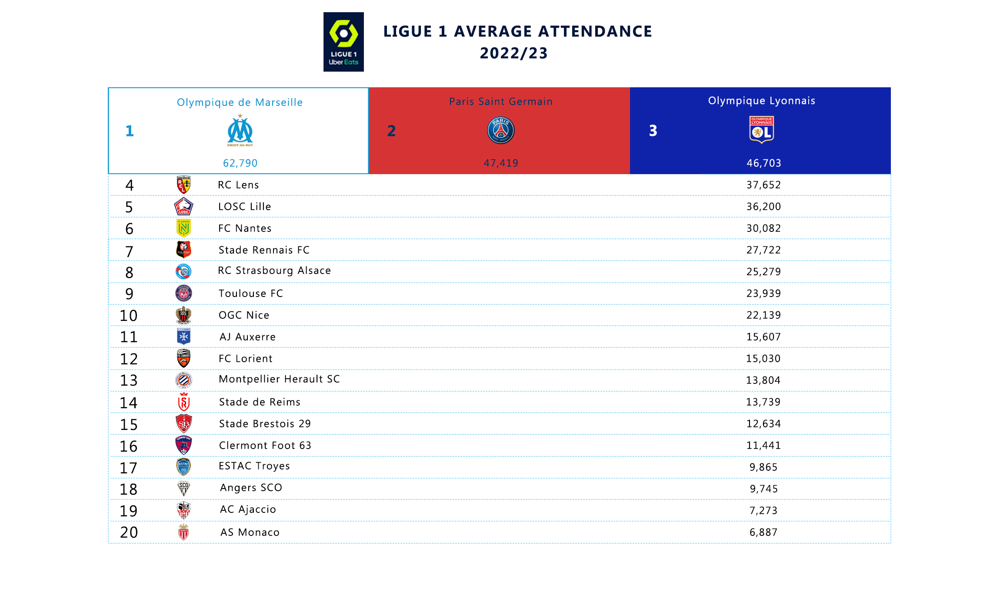
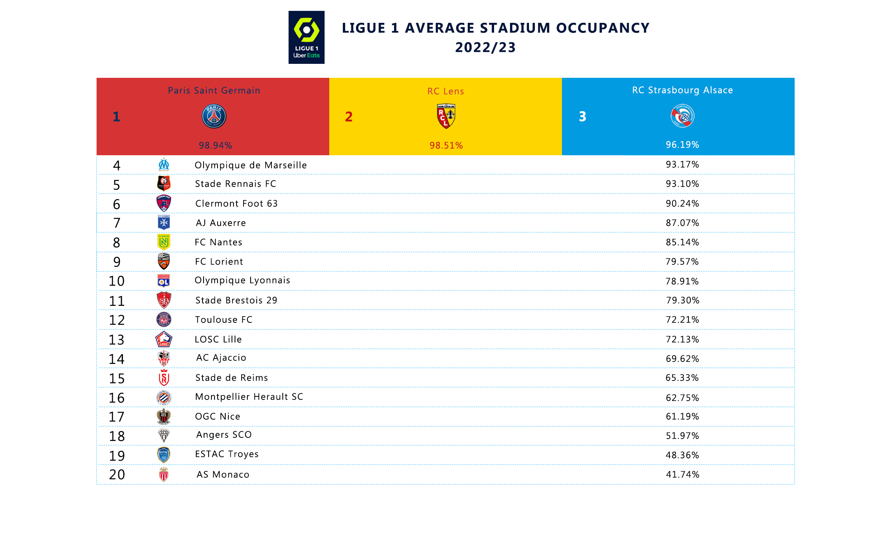

<strong>ABOUT</strong> 
 
Average attendance and average stadium occupancy for French Ligue 1 football clubs for 2022/23 season. All data provided by Ligue 1 official website and stats at https://www.ligue1.com/ 

<strong>NOTES</strong> 
 
Three games are missing attendance reports: 
1. AC Ajaccio - Olympique de Marseille (matchday 38)
2. FC Nantes - RC Strasbourg Alsace (matchday 34)
3. Olympique de Marseille - ESTAC Troyes (matchday 31) 

<strong>OTHER NOTES</strong> 
 
Highest attendance: 65,894 (Olympique de Marseille vs PSG)  
Lowest attendance: 3,061 (AS Monaco vs AJ Auxerre)

Average stadium occupancy for the Ligue 1: 76.27%
Average stadium attendance for the Ligue 1: 23,798

<strong>SCREENSHOTS</strong>

